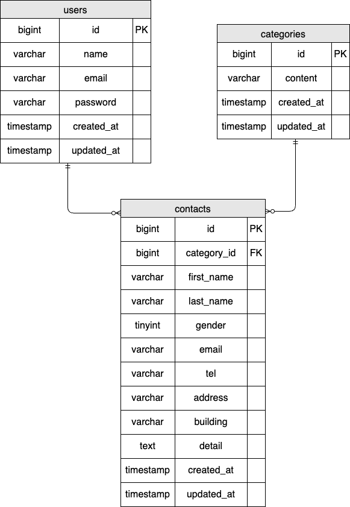

# アプリケーション名
coachtech お問い合わせフォーム

## アプリ概要
アプリ概要

本アプリは、お問い合わせフォームの送信および管理を行うWebアプリケーションです。
ユーザーは入力フォームから必要事項を入力し、確認画面を経てお問い合わせ内容を送信することができます。

送信されたお問い合わせ内容はデータベースに保存され、管理画面から一覧で確認・検索・削除を行うことができます。
また、お問い合わせの種類はカテゴリとして管理されており、選択式で入力できるようになっています。

## 環境構築

1. プロジェクトをクローン

```bash
git clone git@github.com:3170sailing/coachtech-contact-form.git
```

2. プロジェクトへ移動

```bash
cd coachtech-contact-form
```

3. Dockerのビルド＆起動

```bash
docker compose up -d --build
```

4. PHPコンテナへログイン

```bash
docker compose exec php bash
```

5. 必要なパッケージのインストール

```bash
composer install
```

6. .env作成

```bash
cp .env.example .env
```

7. 作成された.envのDB接続を変更

```bash
DB_CONNECTION=mysql
DB_HOST=mysql
DB_PORT=3306
DB_DATABASE=laravel_db
DB_USERNAME=laravel_user
DB_PASSWORD=laravel_pass
```

8. アプリの暗号化キー（APP_KEY）を生成

```bash
php artisan key:generate
```

9. マイグレーション実行

```bash
php artisan migrate
```

10. シーディング実行

```bash
php artisan db:seed
```

## 使用技術
- Laravel 8.83.8
- PHP 8.1
- MySQL 8.0
- Docker

## ER図


## テーブル設計

### contactsテーブル

| カラム名 | 型 | PRIMARY KEY | NOT NULL | FOREIGN KEY | 補足 |
| --- | --- | --- | --- | --- | --- |
| id | bigint unsigned | ○ | ○ |  |  |
| category_id | bigint unsigned |  | ○ | categories(id) |  |
| first_name | varchar(255) |  | ○ |  |  |
| last_name | varchar(255) |  | ○ |  |  |
| gender | tinyint |  | ○ |  | 1:男性 2:女性 3:その他 |
| email | varchar(255) |  | ○ |  |  |
| tel | varchar(255) |  | ○ |  |  |
| address | varchar(255) |  | ○ |  |  |
| building | varchar(255) |  |  |  |  |
| detail | text |  | ○ |  |  |
| created_at | timestamp |  |  |  |  |
| updated_at | timestamp |  |  |  |  |

### categoriesテーブル

| カラム名 | 型 | PRIMARY KEY | NOT NULL | FOREIGN KEY | 補足 |
| --- | --- | --- | --- | --- | --- |
| id | bigint unsigned | ○ | ○ |  |  |
| content | varchar(255) |  | ○ |  | お問い合わせの種類 |
| created_at | timestamp |  |  |  |  |
| updated_at | timestamp |  |  |  |  |

### usersテーブル

| カラム名 | 型 | PRIMARY KEY | NOT NULL | FOREIGN KEY | 補足 |
| --- | --- | --- | --- | --- | --- |
| id | bigint unsigned | ○ | ○ |  |  |
| name | varchar(255) |  | ○ |  |  |
| email | varchar(255) |  | ○ |  |  |
| password | varchar(255) |  | ○ |  |  |
| created_at | timestamp |  |  |  |  |
| updated_at | timestamp |  |  |  |  |

##　 URL
環境開発：https://github.com/3170sailing/contact-form2.git